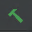

# How to configure CLion for BRAINSTools
By following the instructions below, you will be able to
* Save external packages outside of the build directory to reduce build time
* Build individual BRAINSTools components through the CLion IDE
* Run individual tests through the CLion IDE

### Clone BRAINSTools
Clone BRAINSTools from the git repository.
```bash
git clone https://github.com/BRAINSia/BRAINSTools.git
```
### Build BRAINSTools
Create a build directory outside of the source directory. This will used to obtain the SuperBuild files.
```bash
mkdir BRAINSTools-build
cd BRAINSTools-build
```
Build BRAINSTools in this directory.
```bash
ccmake ../BRAINSTools
```
Type **c** to configure.

To build VTK do the following:
> Once the configuration is finished, type **t** to enter advanced mode. Enable **BRAINSTools_BUILD_DICOM_SUPPOR** by pressing **enter**. Press **t** again to exit advanced mode and then **c** to update the CMake options. Enable both **USE_GTRACT** and **USE_DWIConvert** by pressing **enter** when highlighting their fields.

Set the remaining fields as desired. Once finished, type **c** to configure once more. Then type **g** to generate.

Build with the following command (for Linux):
```bash
make -j 8
```
Make sure to choose a value for j that is appropriate for your computer.

### Configure CLion
Open the BRAINSTools source directory in CLion.
Edit the CMake build options
**File > Settings > Build, Execution, Deployment > CMake**.
Select **RelWithDebInfo** from the drop down selector in the **Build Type** field.

Insert the following into the **CMake Options** field. Make sure to change the path to the location where you built BRAINSTools.
```bash
-C
/PATH/TO/BUILD/BRAINSTools-build/BRAINSTools-prefix/tmp/BRAINSTools-cache-Release.cmake
```

Your CMake settings should now be similar to what is shown in the image below.


Press **OK**. CMake will begin configuring BRAINSTools.
Some unneeded files will have been created before the CMake settings were changed. To clean them up do the following:
* Delete the **cmake-build-debug** directory
* Delete the contents of the **cmake-build-relwithdebinfo** directory (without deleting the directory itself)
* Refresh CMake by pressing the  icon seen in the image below


Now, only the necessary files will exist within the **cmake-build-relwithdebinfo** directory.

### Using BRAINSTools in CLion
Now you can build individual BRAINSTools components or tests within the CLion IDE.
To build a component of BRAINSTools, open the drop down menu in the top right portion of the screen and choose your desired component.

Press the hammer icon  next to the drop down menu to build the component. You may then use the terminal to make use of BRAINSTools.

### Using CTest in CLion
To run BRAINSTools tests scroll to the bottom of the drop down menu, select All CTest, and press the run  icon.
A menu like the one below should appear.

If you would only like to run specific tests, press the stop  icon. Then, right click on your desired test and select **Run 'your_test'**.


CTest supports parallel testing, which speeds up the testing process dramatically. To set this, again, open the drop down menu in the top right and select **Edit Configurations...**.


Add the parameter **-j 8** into the **CTest arguments** field. Make sure to change the **8** to what is appropriate for your computer. Press OK to save your changes.


Now CTest will run much faster.
